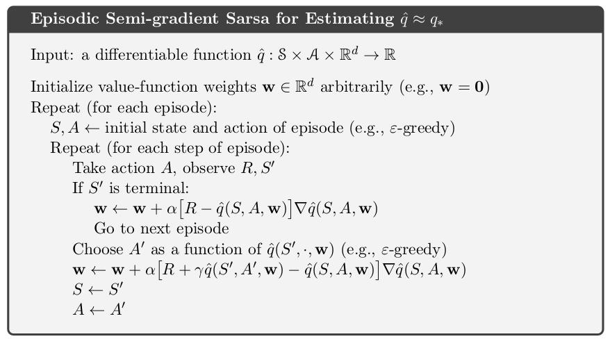

### Deep Learning for Detecting Robotic Grasps

### Learning Hand-Eye Coordination for Robotic Grasping with Deep Learning and Large-Scale Data Collection

### On Learning to Think: Algorithmic Information Theory for Novel Combinations of Reinforcement Learning Controllers and Recurrent Neural World Models

### Compressed Network Search Finds Complex Neural Controllers with a Million Weights

### Value Iteration Network
If action moves agent locally, then can be computed with convolution.

### feedback Network

Iterative representations based on feedback from previous iteration's output. Benefits: early prediction, hierarchical output (taxonomy), provide basis for curriculum learning. [what is it]

### Cognitive Mapping and Planning for Visual Navigation

J. Malik's lab. Mapping is driven by the need of planner. Spatial memory, can plan with incomplete observations of the world. Agent has a belief map of the world. [heavy in mapping, skip it for now]

### DeepMPC: Learning Deep Latent Features for Model Predictive Control

Ian Lenz's paper.

### Data-Efficient Reinforcement Learning with Probabilistic Model Predictive Control

Sent to Tom but haven't read it yet.

### Gaussian Process Model Based Predictive Control

### Predictive control with Gaussian process models

### Deep Recurrent Q-Learning for Partially Observable MDPs
Peter Stone's work

### Deep Reinforcement Learning with Double Q-learning
Original EQN contains a maximization step over estimated values, and this max step is an biased towards higher values. The paper shows DQN has overestimates even when network is deep and environment is deterministic.

### gaussian processes for data-efficient learning in robotics and control
Use Gaussian process to model the transition probability, derive a closed form expression for expected reward/cost for policy evaluation, and analytic policy gradients for policy improvement.

But since we have Tensorflow and other libraries to calculate the gradient automatically, can we still define GP for the model, analytically derive the expected reward (i.e. value function) and use Tf to calculate and update its gradient?

### Approximate Dynamic Programming with Gaussian Processes.pdf (1998)
Assuming transition model is know, use GP to approximate both value function V and action-value function Q. With such approximation, Both GPs learn from discrete state and action pairs, but can be evaluated at continuous action value.

### Gaussian process dynamic programming
Model the value function and state value function as a GP, and use Q-Learning like methods.

This work also use GP as a policy approximation. It is an extension of the above paper in 1998, in that this work also learn the models by using another GP, and online select the state for exploration. The advantage is that we can only explore interesting state and actions along the trajectories, and do not need to sample the regular grid of state and actions like previous paper.  Related to Bayesian optimization and experimental design. In this sense, this GP policy is global, not local.

The first algorithm assumes that model is known, as well as the immediate reward given current state and action. The algorithm does not actually interact with the environment. It just define a set of states sampled from regular grid of state space, and use the assumed transition function to calculate next state and reward. Then use (state, action, new state, reward) to learn Q function approximate by GP.

### Gaussian processes in reinforcement learning
Use GP as approximation of the model. Learn model from data. Model-based policy iteration.

### Probabilistic Inference for Fast Learning in Control
Not like above paper, this work directly optimize policy.

### PILCO/ A Model-Based and Data-Efficient Approach to Policy Search
Proposed to use Gaussian process as an representation of the transition model. Based on GP, calculate the marginal distribution of state, and use that to calculate analytical form of the value function. Then, derive an analytical form for the gradient of the value function with regard to the the policy function's parameters.

The cost/value function is defined such that the expectation with respect to the state distribution is in closed form. This need cost function be in a special form. In this paper it's exponential function of (x - x_target). Such different is different from OpenAI gym, which gives the reward when each action is taken. the environment in gym is like a blackbox, and algorithm designer cannot change definition of reward. On the other hand, the method used in this paper make some sense: if in practice we know the optimal state of the problem, we can define the cost function based on the difference of current state and optimal state. This is similar to my previous thinking: redefine the reward function based on the current states and target states.  

### On-policy and Off-policy learning

On-policy evaluates and improves the policy that is used to generate the data.

From Stackoverflow, off-policy learning such as Q-learning may not be stable, due to the max operation, especially when using functional approximation in case of continuous state. However, recent DQN use replay buffer, and make learning off-policy model more stable.

## Notes: On-policy control with approximation
For problems with continuous states, there are infinite number of choice of state variables, so tabular-based methods such as Q-learning will not work. A natural solution is using functional approximation. In chapter 9 of Sutton's book, functional approximator is used for learning the value function with a fixed policy as input. Then, the method proposed in chapter 10 also learns policy, draw actions from the updated policy and apply the action to the environment. This is called *control*.

It should be noted that in order to *control* the environment while learning the value function, we should learn the state-value function $$Q(s, a)$$ instead of the value function $$V(s)$$. This is because once $$V(s)$$ is updated at each iteration, learning a policy based on $$V(s)$$ still need an optimization process: enumerate all possible actions at current state, and choose action with largest value of $$R_t + \gamma V(s')$$. But in order to know $$S'$$ (the new state), we have to apply each action to the environment, which is impossible at current state.

To show the difference of using function approximation for learning value function, and for both learning and control, here is the algorithm for only learning the value function without control:

<!--  -->

Here is the algorithm for learning while control the environment at the same time:

